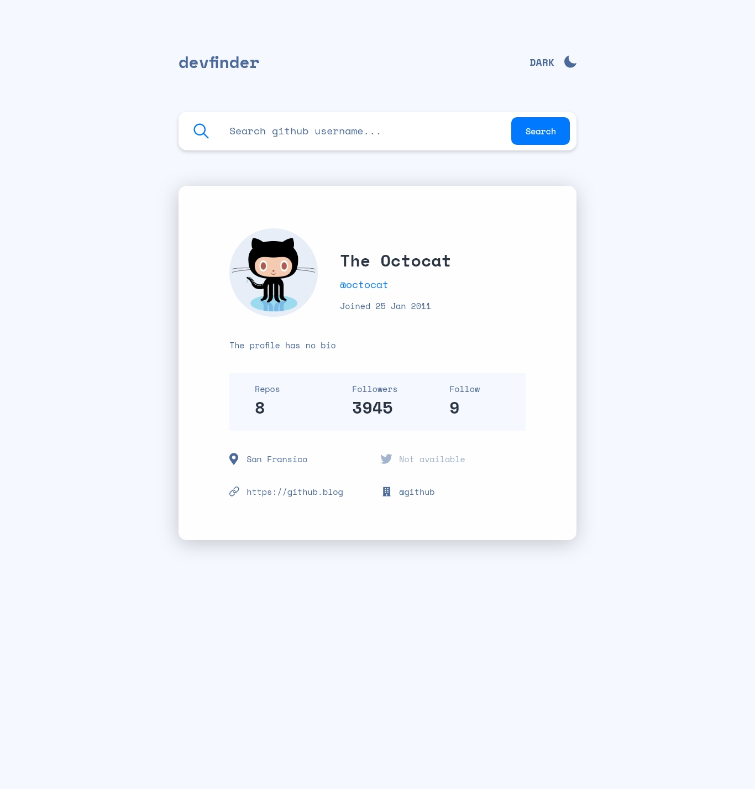

# github-user-search-react-app

This is a page where you can search github users.

## Table of contents

-   [Overview](#overview)
    -   [Screenshot](#screenshot)
    -   [Links](#links)

## Overview

### Screenshot

### Links

-   Live Site URL: [https://github-user-search-react-app-thjo.netlify.app/](https://github-user-search-react-app-thjo.netlify.app/)

## My process

### Built with

-   Semantic HTML5 markup
-   CSS custom properties
-   Flexbox
-   Mobile-first workflow
-   SCSS
-   [React](https://reactjs.org/) - JS library
